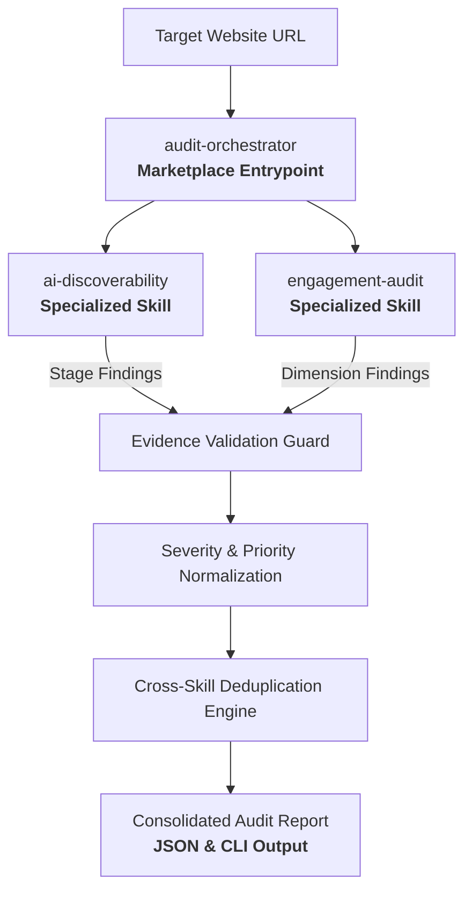

# AI-Readiness Agent Marketplace

### Make websites discoverable, understandable, and actionable for AI agents.

`Adobe University Hackathon 2026 · Round 3 Submission`

The **AI-Readiness Agent Marketplace** is an Agent Skill Marketplace designed for autonomous AI agents to audit public websites across both machine discoverability and on-site user engagement. It coordinates specialized, provider-neutral evaluation skills to convert observable web evidence into prioritized findings and actionable remediation plans.

---

[](#operational-safety--scope)
[](#automated-testing--verification)
[-success.svg)](#repository-structure)
[](#marketplace-architecture--skill-composition)
[](LICENSE)

---

## 1. The Problem

The web is increasingly accessed and navigated through autonomous AI assistants, retrieval-augmented generation (RAG) pipelines, and LLM-driven search systems rather than traditional desktop browsers alone.

For a website to succeed in this AI-mediated environment, two distinct operational questions must be resolved:

```text
                           Website Under Audit
                                    |
                 +------------------+------------------+
                 |                                     |
                 v                                     v
   [ 1. AI Discoverability Gap ]         [ 2. On-Site Engagement Gap ]
   Can AI crawlers and RAG systems       When an AI links directly to a deep
   reach, parse, and cite the site?      page, can visitors orient and act?
   - Crawler access blocks               - Lost brand and product context
   - Client-side rendering dependency    - Missing primary purpose and headings
   - Missing or invalid Schema.org       - Isolated pages without navigation
   - Contradictory identity signals      - Absent call-to-action pathways
```

### AI Discoverability
Automated AI agents ingest web content using non-rendering or lightweight parsing pipelines. If a site restricts AI crawlers in `robots.txt`, defers core content to client-side JavaScript execution, omits structured JSON-LD data, or presents conflicting entity signals, automated assistants fail to index, summarize, and cite the domain accurately.

### On-Site Engagement
When an AI assistant recommends a specific product, guide, or service, it links directly to a **deep-entry page**. If that page lacks persistent navigation, breadcrumbs, clear heading hierarchy, or actionable next steps, visitors become marooned and cannot complete their journey.

Conventional website audits focus narrowly on legacy SEO rankings or cosmetic desktop layout. This marketplace evaluates the complete agent-mediated lifecycle.

---

## 2. The Solution

**One marketplace. One entrypoint. Multiple specialized Agent Skills.**

The system follows the Agent Skills specification by providing a single designated marketplace entrypoint (`audit-orchestrator`) that composes two specialized, decoupled audit skills:

- **`audit-orchestrator`** *(Designated Marketplace Entrypoint)*: Accepts the target website URL, coordinates execution across specialized skills, validates incoming payloads against strict schema contracts, normalizes severity and priority, deduplicates findings, and compiles the final audit report.
- **`ai-discoverability`** *(Specialized Audit Skill)*: Analyzes technical crawler access, structured data, extractability, entity clarity, and citation readiness across a six-stage pipeline.
- **`engagement-audit`** *(Specialized Audit Skill)*: Analyzes structural signals for visitor orientation, contextual continuity, navigation pathways, and conversion actionability on deep landing pages.

---

## 3. Architecture



---

## 4. AI Discoverability: 6-Stage Pipeline

The `ai-discoverability` skill evaluates technical machine readiness across six progressive verification stages:

```text
REACH  -->  READ  -->  EXTRACT  -->  UNDERSTAND  -->  IDENTIFY  -->  TRUST
```

1. **Reach**: Verifies hostname resolution, HTTP availability, redirect chains, and crawler permissions across major AI user-agents (`GPTBot`, `ClaudeBot`, `PerplexityBot`, `Google-Extended`, `Bingbot`).
2. **Read**: Evaluates client-side rendering dependency, raw HTML payload density, text-to-code ratio, and content readability for non-JavaScript automated parsers.
3. **Extract**: Validates presence, syntax, and schema conformance of Schema.org JSON-LD structured data and OpenGraph metadata.
4. **Understand**: Checks semantic HTML document hierarchy (`<header>`, `<main>`, `<article>`, `<nav>`, `<footer>`), heading progression (`h1` through `h6`), and content landmark distribution.
5. **Identify**: Assesses entity identity consistency across page title, meta descriptions, OpenGraph tags, and structured brand references.
6. **Trust**: Evaluates transparency signals, canonical URL declarations, author/publisher attribution, and freshness indicators.

---

## 5. On-Site Engagement: 5 Core Dimensions

The `engagement-audit` skill inspects structural HTML signals to assess whether users directed to deep pages can maintain context and navigate effectively:

1. **Landing Experience**: Checks whether the page provides immediate context, brand attribution, and semantic viewport stability upon entry.
2. **Information Orientation**: Evaluates heading hierarchy, primary content landmarks (`<main>`, `<article>`), and clear topic definition without relying on ambient site memory.
3. **Deep-Page Context Retention**: Identifies isolated nested pages lacking parent identity, site title, or overarching organizational context.
4. **Navigation Pathways**: Verifies breadcrumb trails, utility navigation, parent-directory links, and homepage return routes to prevent user dead-ends.
5. **Meaningful Next Actions**: Inspects primary and secondary call-to-action (CTA) affordances, conversion links, documentation pointers, and contact mechanisms.

---

## 6. Evidence-First Findings

The system rejects generic, speculative statements (such as *"Your website has poor AI readiness"*). Every emitted finding must satisfy a strict finding contract anchored in concrete, observable evidence.

### Representative Finding Example

```json
{
  "id": "ENG-401",
  "category": "on_site_engagement",
  "subcategory": "navigation",
  "title": "Severe lack of exploratory navigation",
  "severity": "high",
  "evidence": "Page contains only 2 internal navigational links and no breadcrumb trail (<nav> landmarks: 0).",
  "why_it_matters": "Visitors landing directly from AI search cannot explore related content or orient within the site hierarchy.",
  "suggested_action": {
    "summary": "Implement breadcrumbs and structured internal navigation",
    "details": "Add a breadcrumb navigation trail and related-topic links within a semantic <nav> element.",
    "priority": "high"
  }
}
```

### Finding Contract Attributes
- **`id`**: Canonical, unique finding code (`DISC-###` or `ENG-###`).
- **`severity`**: Base technical severity (`critical`, `high`, `medium`, `low`).
- **`evidence`**: Observable proof citing specific DOM selectors, element counts, HTTP status codes, or `robots.txt` lines.
- **`why_it_matters`**: Mechanism-sound explanation of how the defect impairs AI discovery or user journey.
- **`suggested_action`**: Concrete remediation instructions with calculated action `priority`.

---

## 7. Consolidated Audit Report

The orchestrator produces a consolidated report available in both human-readable CLI summary and machine-parsable JSON format:

```json
{
  "site": "https://example.com",
  "audited_at": "2026-09-11T02:00:00Z",
  "summary": {
    "total_findings": 4,
    "critical": 0,
    "high": 1,
    "medium": 2,
    "low": 1
  },
  "findings": [
    {
      "id": "DISC-002",
      "category": "ai_discoverability",
      "subcategory": "structured_data",
      "title": "Missing Schema.org JSON-LD Structured Data",
      "severity": "medium",
      "evidence": "Found 0 <script type=\"application/ld+json\"> blocks in HTML source.",
      "why_it_matters": "Without structured data, AI systems must infer entities, schemas, and relationships with lower confidence.",
      "suggested_action": {
        "summary": "Add Schema.org JSON-LD metadata",
        "details": "Embed a structured <script type=\"application/ld+json\"> block defining Organization or WebPage entities.",
        "priority": "medium"
      }
    }
  ],
  "modules": {
    "ai-discoverability": {
      "status": "success",
      "findings_count": 2,
      "error": null
    },
    "engagement-audit": {
      "status": "success",
      "findings_count": 2,
      "error": null
    }
  },
  "limitations": [],
  "prioritized_action_plan": [
    {
      "priority": "high",
      "finding_id": "ENG-401",
      "title": "Severe lack of exploratory navigation",
      "summary": "Implement breadcrumbs and structured internal navigation"
    }
  ]
}
```

---

## 8. What Makes the System Defensible

- **Read-Only by Design**: Audits execute purely passive `GET` and `HEAD` requests. The system never performs authenticated site modifications, submits forms, or alters target domains.
- **Evidence-Grounded Finding Validation**: Findings missing observable proof are rejected by the orchestrator validation guard to prevent unsupported claims.
- **Conservative Deduplication**: Findings are fingerprinted across domain categories to avoid collapsing distinct issues while merging redundant multi-page notices into aggregated evidence trails.
- **Graceful Degradation**: If an individual skill module encounters network failure or parsing exceptions, findings from healthy modules are preserved and explicit limitations are appended to the report.
- **Robots-Aware Bounded Crawling**: Crawling respects `robots.txt` disallow rules, enforces a bounded crawl budget (default 5 pages), and applies strict network timeouts (default 10s).
- **Provider-Neutral Architecture**: Evaluates standard web specifications (HTML5, W3C WAI-ARIA, Schema.org, OpenGraph) rather than proprietary search platform rules.

---

## 9. Engineering Highlights

| Capability | Verified Implementation |
| :--- | :--- |
| **Agent Skills** | 3 (`audit-orchestrator`, `ai-discoverability`, `engagement-audit`) |
| **Marketplace Entrypoints** | 1 (`audit-orchestrator`) |
| **Audit Domains** | 2 (AI Discoverability, On-Site Engagement) |
| **Discoverability Stages** | 6 (Reach, Read, Extract, Understand, Identify, Trust) |
| **Engagement Dimensions** | 5 (Landing, Orientation, Context, Navigation, Next Actions) |
| **Automated Tests** | 195 tests passing (0 failures, 0 skipped) |
| **Runtime Dependencies** | Pure Python Standard Library (no third-party pip dependencies) |
| **Audit Mode** | Read-only by design (passive HTTP inspection) |
| **Release Package Size** | ~140 KB (139.8 KB / 62 files, well below the 50 MB limit) |

---

## 10. Quick Start

### Prerequisites
- Python 3.10 or higher.
- Pure Python standard library (no `pip install` required for audit execution).

### Run an Audit via CLI

```bash
# Human-readable summary output
python skills/audit-orchestrator/scripts/orchestrator.py https://example.com

# Machine-readable JSON output to stdout
python skills/audit-orchestrator/scripts/orchestrator.py https://example.com --json

# Save JSON audit report directly to a file
python skills/audit-orchestrator/scripts/orchestrator.py https://example.com --out report.json
```

---

## 11. Automated Testing & Verification

The test suite validates contract enforcement, stage heuristics, engagement dimensions, error resilience, and edge cases:

```bash
# Execute the complete test suite
python -m pytest tests/ -v
```

### Verified Test Suite Breakdown (195 Passing Tests)
- **AI Discoverability Unit & Stage Tests (128 tests)**: `Reach`, `Read`, `Extract`, `Understand`, `Identify`, `Trust` stages.
- **On-Site Engagement Unit Tests (22 tests)**: Orientation, heading structures, navigation landmarks, and CTA detectors.
- **Orchestrator Contract & Schema Validation (13 tests)**: Input URL sanitization, finding envelope validation, and report generation.
- **Integration & Skill Composition (14 tests)**: Multi-skill execution, cross-skill deduplication, and graceful degradation.
- **18-Pattern Unseen Website Matrix (18 tests)**: Hardening against malformed HTML, redirect loops, partial crawlers, and edge-case layouts.

---

## 12. Repository Structure

```text
AI-Readiness-Agent-Marketplace/
├── marketplace.json                    # Marketplace catalog and entrypoint definition
├── README.md                           # Product landing page and usage guide
├── LICENSE                             # MIT License
├── docs/                               # Technical specifications and methodology
│   ├── architecture.md                 # System architecture and data flow
│   ├── methodology.md                  # Scoring model and evidence criteria
│   └── integration-checklist.md        # Pre-merge verification standards
├── skills/                             # Agent Skills
│   ├── audit-orchestrator/             # Designated marketplace entrypoint
│   │   ├── SKILL.md                    # Orchestrator skill specification
│   │   ├── references/                 # Input, finding, and report JSON schemas
│   │   └── scripts/                    # Orchestrator, validation, normalization
│   ├── ai-discoverability/             # Specialized AI discoverability skill
│   │   ├── SKILL.md                    # Discoverability skill specification
│   │   ├── references/                 # Stage criteria documentation
│   │   └── scripts/                    # 6-stage audit engine
│   └── engagement-audit/               # Specialized on-site engagement skill
│       ├── SKILL.md                    # Engagement skill specification
│       ├── references/                 # Engagement criteria documentation
│       └── scripts/                    # 5-dimension evaluator and DOM parser
├── tests/                              # Automated test suite (195 tests)
│   ├── conftest.py                     # Module resolution and test fixtures
│   ├── discoverability/                # Discoverability stage test suites
│   ├── integration/                    # Orchestration and 18-pattern test matrix
│   └── test_engagement_audit.py        # Engagement unit test suite
└── scripts/                            # Release packaging and validation tools
    └── package_release.py              # Deterministic ZIP packager and verifier
```

---

## 13. Agent Skills Compliance

This project complies strictly with the Agent Skills specification:
- Every skill directory contains a dedicated [`SKILL.md`](skills/audit-orchestrator/SKILL.md) with YAML frontmatter (`name`, `description`).
- [`marketplace.json`](marketplace.json) defines exactly **one designated entrypoint** (`audit-orchestrator`) that encapsulates full multi-skill execution.
- Subordinate skills (`ai-discoverability` and `engagement-audit`) are modular, reusable, and independently callable.

---

## 14. Operational Safety & Scope

- **Public Web Auditing**: Designed for public, accessible web endpoints.
- **Read-Only by Design**: Issues only idempotent `GET` and `HEAD` HTTP requests without modifying server state.
- **Bounded Resources**: Adheres to strict crawl limits, timeout bounds, and `robots.txt` disallow parameters.
- **No External Dependencies**: Operates entirely within the Python standard library without third-party network services.

---

## 15. Technical References & Deep Documentation

- [Architecture & Technical Design](docs/architecture.md)
- [Audit Methodology & Scoring Framework](docs/methodology.md)
- [Integration Checklist & Verification Standards](docs/integration-checklist.md)
- [Audit Orchestrator Skill Specification](skills/audit-orchestrator/SKILL.md)
- [AI Discoverability Skill Specification](skills/ai-discoverability/SKILL.md)
- [On-Site Engagement Skill Specification](skills/engagement-audit/SKILL.md)
- [Input Schema Reference](skills/audit-orchestrator/references/input_schema.json)
- [Finding Contract Schema Reference](skills/audit-orchestrator/references/finding_schema.json)
- [Final Report Schema Reference](skills/audit-orchestrator/references/report_schema.json)

---

## 16. Project Context

**Adobe University Hackathon 2026 — Round 3 Submission**

Developed by **Lakshya**, **Aditya**, and **Vishesh**.

Built for the Agent Skill Marketplace challenge, this project equips autonomous AI agents with structured skills to evaluate whether websites are discoverable to machines and navigable to human visitors arriving via AI-mediated discovery.

---

From *"Can an AI agent find my website?"* to *"Can it understand the content, identify the right context, and help the user take the next step?"*
