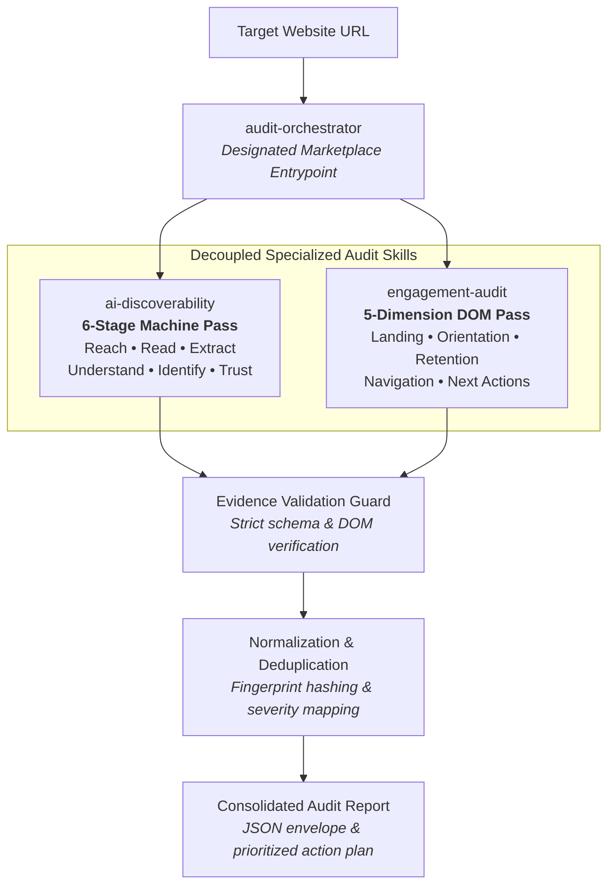
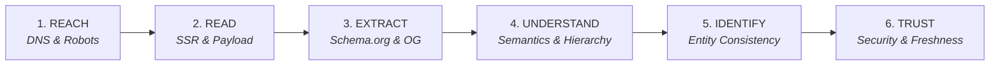

<div align="center">

# AI-Readiness Agent Marketplace

### Make every website discoverable, understandable, and actionable for AI agents.

**Adobe University Hackathon 2026 · Round 3: Development Round**

[](#the-marketplace)
[](#why-the-marketplace-is-decomposed)
[](#validation--generalization)
[](#safety-by-design)
[](#repository-structure)
[](LICENSE)

</div>

---

## Executive Summary

The **AI-Readiness Agent Marketplace** provides autonomous AI agents with specialized, composable Agent Skills to audit any public website across machine discoverability and human landing engagement.

Operating through a single designated entrypoint (`audit-orchestrator`), the marketplace coordinates domain-specific evaluation engines to inspect server payloads, parse DOM structures, validate semantic metadata, and produce evidence-backed findings alongside prioritized remediation plans.

> [!NOTE]
> **Core Definition**: A reusable Agent Skill Marketplace that combines technical AI discoverability and human on-site engagement auditing into one unified, evidence-backed workflow.

```text
Target Website URL ──▶ audit-orchestrator ──▶ [ai-discoverability + engagement-audit] ──▶ Evidence-Backed Action Plan
```

---

## The Problem

The modern web is increasingly navigated by autonomous AI agents, retrieval-augmented generation (RAG) pipelines, and LLM search crawlers rather than human desktop browsers alone.

Traditional website audits focus narrowly on legacy search engine ranking factors and desktop visual styling. In an agent-mediated web, websites suffer from two complementary structural failure modes:

| Failure Mode | Root Cause | Impact on Autonomous Agents & Visitors |
| :--- | :--- | :--- |
| **AI Discoverability Gap** | Crawlers blocked in `robots.txt`, empty client-side JS shells, missing Schema.org JSON-LD, contradictory entity metadata, broken headings. | AI agents and indexers cannot reach, parse, synthesize, or cite site content. |
| **On-Site Engagement Gap** | Direct deep links lack parent brand context, heading progressions are broken, exploratory navigation is absent, no next steps provided. | When an AI links a user to a deep page, the user is disoriented and cannot navigate or convert. |

---

## The Marketplace

The marketplace is architected strictly under the **Agent Skills Specification**, exposing one orchestrator that delegates to decoupled, domain-specific audit skills:



---

## Why the Marketplace Is Decomposed

A monolithic audit script creates brittle dependencies and tightly coupled evaluations. Decomposing the system into specialized Agent Skills provides modularity, independent execution, and clean separation of concerns.

### The Three Skills

| Skill | Role | Scope & Capabilities |
| :--- | :--- | :--- |
| **`audit-orchestrator`** | **Designated Entrypoint** | Validates target URLs, executes audit skills in sequence or parallel, enforces finding schemas, normalizes severities, eliminates duplicate issues, and compiles the prioritized action plan. |
| **`ai-discoverability`** | Specialized Audit Skill | Evaluates technical machine readability across six progressive stages: crawler permissions, SSR text density, structured JSON-LD data, semantic HTML hierarchies, entity consistency, and trust signals. |
| **`engagement-audit`** | Specialized Audit Skill | Evaluates visitor experience on deep landing pages across five structural dimensions: orientation, heading progression, parent context retention, exploratory navigation, and conversion next actions. |

### Architectural Principles

| Principle | Implementation in This Marketplace | Engineering Rationale |
| :--- | :--- | :--- |
| **Single Entrypoint** | Exactly one marketplace entrypoint (`audit-orchestrator`) declared in `marketplace.json`. | Eliminates routing ambiguity for host LLM agents. |
| **Composable Skills** | Specialized skills run independently or as part of the orchestrated pipeline. | Enables modular maintenance and targeted single-domain audits. |
| **Shared Finding Contract** | All findings adhere to a uniform JSON schema (`id`, `severity`, `evidence`, `suggested_action`). | Guarantees deterministic processing and clean report aggregation. |
| **Evidence-First Findings** | Every finding requires concrete, observable proof (DOM selectors, HTTP status, robots lines). | Rejects speculative statements and eliminates hallucinations. |
| **Conservative Deduplication**| Fingerprints findings by category and root cause while preserving distinct issues. | Prevents repetitive noise without dropping unique architectural flaws. |
| **Read-Only Execution** | Passive HTTP `GET`/`HEAD` requests; zero site modifications, state changes, or form submissions. | Safe for automated scanning against any public web property. |
| **Pure Python Runtime** | Zero third-party dependencies; executes entirely within the Python 3.10+ standard library. | Zero installation friction, instant startup, and dependable execution. |

---

## AI Discoverability

The `ai-discoverability` skill evaluates whether autonomous AI agents, crawlers, and RAG indexers can access, extract, and interpret site content through a progressive six-stage inspection pipeline:



### Evaluation Stages

| Stage | Inspection Target | Observable Evidence Evaluated |
| :--- | :--- | :--- |
| **Reach** | Connectivity & AI Crawler Access | Hostname resolution, HTTP response codes, redirect chains, and AI crawler permissions (`GPTBot`, `ClaudeBot`, `PerplexityBot`, `Google-Extended`, `Bingbot`). |
| **Read** | Machine-Readable Payload Density | Client-side JavaScript rendering dependency, initial server-delivered HTML text density, and non-JavaScript text-to-code ratio. |
| **Extract** | Structured Data & Metadata | Schema.org JSON-LD syntax, schema conformance, required properties, and OpenGraph metadata presence. |
| **Understand** | Document Structure & Semantics | Semantic HTML5 elements (`<main>`, `<article>`, `<nav>`, `<footer>`), heading hierarchy (`h1`–`h6`), and content landmark distribution. |
| **Identify** | Entity & Brand Consistency | Entity consistency across page titles, OpenGraph metadata, and structured data declarations. |
| **Trust** | Authority & Verification Signals | HTTPS transport security, author/publisher attribution, canonical URL integrity, and content freshness indicators. |

---

## On-Site Engagement

When an AI assistant directs a user to a specific deep link, that destination page must orient the user immediately. The `engagement-audit` skill inspects the DOM across five structural dimensions:

| Dimension | Inspection Target | What It Evaluates |
| :--- | :--- | :--- |
| **Landing Experience** | Initial Viewport & Context | Immediate brand identity, viewport semantic stability, and clear value proposition upon arrival. |
| **Information Orientation** | Structural Clarity | Heading progression and semantic landmark distribution enabling comprehension without prior site knowledge. |
| **Deep-Page Context Retention** | Parent & Site Hierarchy | Detection of isolated nested pages lacking parent identity, site title, or overarching organizational context. |
| **Navigation Pathways** | Exploration & Wayfinding | Availability of breadcrumbs, header/footer links, parent-directory links, and clear return routes. |
| **Meaningful Next Actions** | Conversion & Follow-Through | Primary and secondary call-to-action affordances, documentation links, contact pathways, and conversion options. |

---

## Evidence-First Findings

The marketplace rejects subjective guesses and generic advice. Every finding produced by any skill conforms to a strict contract grounded in observable DOM and network evidence:

> [!TIP]
> **Verification Principle**: Observable Evidence $\longrightarrow$ Failure Mechanism $\longrightarrow$ Actionable Remediation. Findings are never speculative assertions; every issue requires verifiable DOM selectors or HTTP headers.

### Finding Contract Example

```json
{
  "id": "ENG-401",
  "category": "on_site_engagement",
  "subcategory": "navigation",
  "title": "Severe lack of exploratory navigation",
  "severity": "high",
  "evidence": "The landing page contains 0 <nav> elements, 0 headers/footers, and fewer than 2 total links.",
  "why_it_matters": "Users are effectively trapped on this page with no structural pathways to explore the broader website.",
  "suggested_action": {
    "summary": "Add site navigation structure",
    "details": "Provide header navigation, footer links, or contextual related links to allow users to explore the site.",
    "priority": "high"
  }
}
```

---

## Consolidated Audit Output

The `audit-orchestrator` aggregates findings across all executed skills, validates schemas, eliminates duplicates, and synthesizes a structured JSON envelope paired with a prioritized action plan:

```json
{
  "site": "https://example.com",
  "audited_at": "2026-09-12T01:00:00Z",
  "summary": {
    "total_findings": 2,
    "critical": 0,
    "high": 1,
    "medium": 0,
    "low": 1
  },
  "findings": [ ... ],
  "modules": {
    "ai_discoverability": { "status": "success", "findings_count": 1 },
    "on_site_engagement": { "status": "success", "findings_count": 1 }
  },
  "limitations": [ ... ],
  "prioritized_action_plan": [
    {
      "finding_id": "ENG-401",
      "category": "on_site_engagement",
      "title": "Severe lack of exploratory navigation",
      "severity": "high",
      "priority": "high",
      "action_summary": "Add site navigation structure",
      "action_details": "Provide header navigation, footer links, or contextual related links to allow users to explore the site."
    }
  ]
}
```

---

## Safety by Design

The marketplace is engineered from the ground up to be safe for automated scanning against any public web property.

> [!IMPORTANT]
> **Safety Invariants**: Pure passive inspection (`GET`/`HEAD` only) with bounded crawl budgets, zero state mutation, standard-library execution, and strict `robots.txt` compliance.

| Guardrail | Enforcement Mechanism | Safety Guarantee |
| :--- | :--- | :--- |
| **Read-Only Inspection** | Passive HTTP `GET` and `HEAD` requests only. | Zero state mutations, form submissions, or site modifications. |
| **Bounded Crawl Budget** | Strict default budget (5 pages) and request timeout (10s). | Prevents crawler runaway and eliminates server overload risks. |
| **Robots-Aware Protocol** | Parses and respects `robots.txt` directives. | Honors site owner crawl policies and indexing boundaries. |
| **Provider Neutrality** | Evaluates open W3C, HTML5, ARIA, and Schema.org standards. | No bias toward proprietary platform heuristics. |
| **Zero Model Dependencies**| Algorithmic inspection and deterministic parsers. | No runtime LLM API costs, token limits, or neural hallucinations. |
| **Graceful Fault Tolerance**| Isolated skill execution and exception handling. | Individual skill failures record limitations without crashing the pipeline. |

---

## Validation & Generalization

The marketplace implementation is verified through comprehensive automated testing, contract validation, and real-world public site verification.

> [!NOTE]
> **Engineering Verification**: 200 automated tests passing across 5 dedicated test suites, validated against 18 synthetic edge-case patterns and live public websites.

### Verification Matrix

| Test Suite | Scope & Coverage | Status |
| :--- | :--- | :--- |
| **Discoverability Stage Tests** | 133 unit and stage tests covering DNS, robots, SSR, JSON-LD, headings, and entity rules. | 133 Passing |
| **Engagement Audit Tests** | 22 DOM parser and 5-dimension engagement evaluation tests. | 22 Passing |
| **Orchestrator Contract Tests** | 13 URL validation, schema enforcement, and normalization tests. | 13 Passing |
| **Integration & Deduplication** | 14 multi-skill orchestration and cross-domain deduplication tests. | 14 Passing |
| **18-Pattern Unseen Matrix** | 18 synthetic website pattern tests covering diverse edge cases and layouts. | 18 Passing |
| **Total Automated Coverage** | **Comprehensive end-to-end test suite** | **200 Passing** |

### Empirical Hardening

- **Live Public Website Validation**: Tested across diverse real-world web architectures (`react.dev`, `stripe.com`, `adobe.com`, `vercel.com`, `pypi.org`, `docs.python.org`, `example.com`).
- **Cross-Inspector Consistency**: Regression-tested data model contracts (`ReadObservation`) across all downstream evaluation inspectors.
- **Graceful Degradation**: Validated partial failure handling when individual network endpoints or sub-skills encounter timeouts.

---

## Getting Started

### Prerequisites

- **Runtime**: Python 3.10 or higher. Built entirely with the Python standard library; zero third-party packages required at runtime.
- **Testing**: Running the automated test suite requires `pytest`.

### Run an Audit via CLI

```bash
# Human-readable CLI summary table
python skills/audit-orchestrator/scripts/orchestrator.py https://example.com

# Machine-readable JSON output to stdout
python skills/audit-orchestrator/scripts/orchestrator.py https://example.com --json

# Save structured JSON report to file
python skills/audit-orchestrator/scripts/orchestrator.py https://example.com --out report.json
```

### Run Programmatically via Python API

```python
import sys
from pathlib import Path

# Add orchestrator script path
sys.path.insert(0, str(Path("skills/audit-orchestrator/scripts")))
from orchestrator import AuditOrchestrator

orchestrator = AuditOrchestrator()
report = orchestrator.run_audit("https://example.com")
print(report.to_dict())
```

### Run the Test Suite

```bash
python -m pytest tests/ -v
```

---

## Repository Structure

```text
AI-Readiness-Agent-Marketplace/
├── marketplace.json                    # Marketplace catalog and single entrypoint definition
├── README.md                           # Marketplace overview and technical specifications
├── LICENSE                             # MIT License
├── docs/                               # Technical architecture and methodology
│   ├── architecture.md                 # System architecture and data flow
│   ├── methodology.md                  # Scoring model and evidence criteria
│   └── integration-checklist.md        # Pre-merge verification standards
├── skills/                             # Agent Skills
│   ├── audit-orchestrator/             # Designated marketplace entrypoint
│   │   ├── SKILL.md                    # Orchestrator skill specification
│   │   ├── references/                 # Input, finding, and report JSON schemas
│   │   └── scripts/                    # Orchestrator, validation, normalization
│   ├── ai-discoverability/             # Specialized AI discoverability skill
│   │   ├── SKILL.md                    # Discoverability skill specification
│   │   ├── references/                 # Stage criteria documentation
│   │   └── scripts/                    # 6-stage audit engine
│   └── engagement-audit/               # Specialized on-site engagement skill
│       ├── SKILL.md                    # Engagement skill specification
│       ├── references/                 # Engagement criteria documentation
│       └── scripts/                    # 5-dimension evaluator and DOM parser
└── tests/                              # Automated test suite (200 tests)
    ├── conftest.py                     # Module resolution and test fixtures
    ├── discoverability/                # Discoverability stage test suites
    ├── integration/                    # Orchestration and 18-pattern test matrix
    └── test_engagement_audit.py        # Engagement unit test suite
```

---

## Submission Context

This project is packaged as a self-contained Agent Skill Marketplace compliant with the **Adobe University Hackathon 2026 Round 3** requirements.

### Deep Documentation Links

- [Architecture & Technical Design](docs/architecture.md)
- [Audit Methodology & Scoring Framework](docs/methodology.md)
- [Integration Checklist & Verification Standards](docs/integration-checklist.md)
- [Marketplace Catalog Manifest](marketplace.json)

---

<div align="center">

### Built for Adobe University Hackathon 2026

**AI-Readiness Agent Marketplace**

Designed and developed by:

**Lakshya Dogra · Aditya Agrawal · Vishesh Nigam**

<br/>

© 2026 Lakshya Dogra, Aditya Agrawal, and Vishesh Nigam. All rights reserved.

*Built as an AI-readiness auditing prototype for the Adobe University Hackathon 2026.*

</div>
