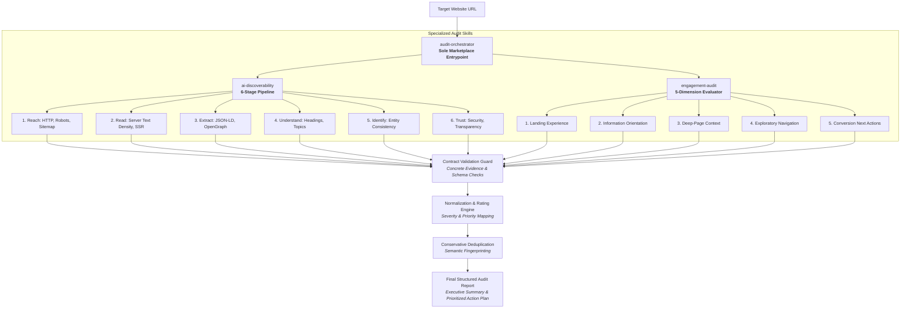

# AI Readiness Agent Marketplace

> **Adobe University Hackathon 2026 — Round 3 Submission**  
> An Agent Skill Marketplace providing modular, evidence-backed website audits across AI Discoverability and On-Site Engagement.

[](#operational-safety--boundaries)
[](#verification--test-suite)
[-success.svg)](#repository--marketplace-structure)
[](#marketplace-skills--architecture)
[](LICENSE)

---

## 1. Overview

The **AI Readiness Agent Marketplace** provides composable, provider-neutral Agent Skills that enable general-purpose AI agents to audit an arbitrary public website for readiness in an AI-mediated web ecosystem.

As users increasingly rely on autonomous AI agents, retrieval-augmented generation (RAG) engines, and LLM-powered assistants (such as ChatGPT Search, Claude, and Perplexity) to discover information, websites must perform across two interdependent dimensions:
1. **Machine Discoverability**: Ensuring automated crawlers and ingestion pipelines can reach, parse, extract, understand, and verify the site's content.
2. **Visitor & Agent-Directed Engagement**: Ensuring that when an agent directs a user to a landing page or deep nested link, the viewport immediately provides context, orientation, navigational pathways, and clear conversion next actions.

The marketplace is implemented with **zero runtime external dependencies** (using pure Python standard library), operates **read-only by design**, and enforces **evidence-grounded finding validation** where every reported issue is anchored in observable HTML/HTTP evidence.

---

## 2. The Problem: The AI-Mediated Web

Traditional web optimization focused primarily on keyword placement and visual rendering for human desktop browsers. In modern AI-assisted web discovery, websites encounter two distinct challenges:

```text
                           Website Under Evaluation
                                      |
                 +--------------------+--------------------+
                 |                                         |
                 v                                         v
   [ 1. AI Discoverability Gap ]             [ 2. On-Site Engagement Gap ]
   Can AI crawlers & RAG agents             When an AI sends a visitor to
   reach, parse, and cite content?           a deep page, can they orient & act?
   - Robots.txt blocking AI user-agents      - AI deep-entry losing brand context
   - Client-side JS rendering deficits       - Missing primary headings / orientation
   - Malformed Schema.org JSON-LD            - Isolated pages with zero navigation
   - Contradictory brand identity signals    - Missing actionable next steps / CTAs
```

### Dimension 1: AI Discoverability
Automated AI agents ingest web content using non-rendering or lightweight extraction pipelines. If a website blocks AI user-agents in `robots.txt`, defers core text to client-side JavaScript execution, omits structured Schema.org JSON-LD, or declares conflicting brand identities across OpenGraph and title tags, automated search assistants fail to index, summarize, or cite the domain accurately.

### Dimension 2: On-Site Engagement
When an AI assistant recommends a specific product, documentation guide, or solution, it links directly to a **deep-entry page**. If that deep page lacks persistent navigation, breadcrumbs, homepage egress, or actionable call-to-action (CTA) affordances, visitors become marooned and cannot complete their journey.

---

## 3. Marketplace Architecture & Skill Composition

The marketplace follows the Agent Skills specification with **exactly one designated entrypoint** (`audit-orchestrator`) that composes two specialized, decoupled audit skills:



### Why Modular Composition?
- **Domain Separation**: Discoverability heuristics (HTTP headers, robots parsing, JSON-LD extraction) remain isolated from structural viewport engagement heuristics.
- **Independent Testability**: Each skill maintains dedicated unit and stage tests alongside unified integration tests.
- **Centralized Governance**: The orchestrator enforces schema contracts, deduplicates cross-module findings, and coordinates graceful degradation.

---

## 4. Marketplace Skills Inventory

| Skill Name | Marketplace Role | Directory | Primary Responsibilities |
|---|---|---|---|
| **`audit-orchestrator`** | **Sole Entrypoint** | [`skills/audit-orchestrator/`](skills/audit-orchestrator/) | Validates input URLs, coordinates specialized audit skills, enforces finding schemas, normalizes ratings, executes conservative deduplication, handles single-module failures gracefully, and compiles the final audit report. |
| **`ai-discoverability`** | Reusable Skill | [`skills/ai-discoverability/`](skills/ai-discoverability/) | Executes a 6-stage pipeline: **Reach** (HTTP availability, robots.txt AI permissions, sitemap discovery), **Read** (server-rendered text density, SPA dependencies), **Extract** (Schema.org JSON-LD syntax, semantic landmarks), **Understand** (heading hierarchies, topical clarity), **Identify** (brand entity consistency across metadata), and **Trust** (transport security, transparency disclosures). |
| **`engagement-audit`** | Reusable Skill | [`skills/engagement-audit/`](skills/engagement-audit/) | Performs structural DOM evaluation across 5 dimensions: **Landing Experience** (H1/title clarity), **Information Orientation** (metadata/breadcrumbs), **Deep-Page Context Retention** (AI referral egress, root links), **Exploratory Navigation** (link affordances), and **Meaningful Next Action** (CTA buttons, forms, and conversion pathways). |

---

## 5. Input & Output Contracts

### Input Contract
The entrypoint accepts a clean website URL via CLI or programmatic dictionary:
```json
{
  "site": "https://example.com"
}
```

### Shared Finding Contract
Every finding emitted by a skill must conform to the unified data contract:
```json
{
  "id": "DISC-001",
  "category": "ai_discoverability",
  "subcategory": "structured_data",
  "title": "Missing Schema.org Organization JSON-LD markup",
  "severity": "high",
  "evidence": "Audited https://example.com - 0 JSON-LD Organization script tags found in HTML head or body.",
  "why_it_matters": "Automated AI retrieval engines and knowledge graphs cannot verify corporate entity identity or official brand relationships without structured data.",
  "suggested_action": {
    "summary": "Implement Schema.org Organization markup in JSON-LD",
    "details": "Embed a JSON-LD script on the homepage defining '@type': 'Organization', 'name', 'url', and 'sameAs' official social profiles.",
    "priority": "high"
  }
}
```

### Final Report Schema
The orchestrator emits a consolidated JSON report structured as follows:
```json
{
  "site": "https://example.com",
  "audited_at": "2026-09-10T20:15:54.800012+00:00",
  "summary": {
    "total_findings": 2,
    "critical": 0,
    "high": 1,
    "medium": 0,
    "low": 1
  },
  "findings": [
    {
      "id": "ENG-401",
      "category": "on_site_engagement",
      "subcategory": "navigation",
      "title": "Severe lack of exploratory navigation",
      "severity": "high",
      "evidence": "The landing page contains 0 <nav> elements, 0 headers/footers, and fewer than 2 total links.",
      "why_it_matters": "Users are effectively trapped on this page with no structural pathways to explore the broader website.",
      "suggested_action": {
        "summary": "Add site navigation structure",
        "details": "Provide header navigation, footer links, or contextual related links to allow users to explore the site.",
        "priority": "high"
      }
    },
    {
      "id": "DISC-001",
      "category": "ai_discoverability",
      "subcategory": "semantic_structure",
      "title": "Missing Primary Content Landmark",
      "severity": "low",
      "evidence": "Page at https://example.com/ lacks a <main> tag, <article> tag, or role='main' attribute.",
      "why_it_matters": "Semantic landmarks help screen readers and AI agents identify the primary content region, ignoring navigation and footers.",
      "suggested_action": {
        "summary": "Add primary semantic landmark",
        "details": "Wrap the primary page content in a <main> tag.",
        "priority": "medium"
      },
      "methodology": "Extract"
    }
  ],
  "modules": {
    "ai_discoverability": { "status": "success", "findings_count": 1 },
    "on_site_engagement": { "status": "success", "findings_count": 1 }
  },
  "limitations": [
    "robots.txt inspection notice: https://example.com/robots.txt returned status 404 (HTTP 404: Not Found).",
    "Read stage analyzed initial server-delivered HTML; browser-rendered DOM comparison is not active in this non-browser pass.",
    "Analyzes structural DOM without executing browser JavaScript or rendering CSS layout."
  ],
  "prioritized_action_plan": [
    {
      "finding_id": "ENG-401",
      "category": "on_site_engagement",
      "title": "Severe lack of exploratory navigation",
      "severity": "high",
      "priority": "high",
      "action_summary": "Add site navigation structure",
      "action_details": "Provide header navigation, footer links, or contextual related links to allow users to explore the site.",
      "affected_pages": []
    },
    {
      "finding_id": "DISC-001",
      "category": "ai_discoverability",
      "title": "Missing Primary Content Landmark",
      "severity": "low",
      "priority": "medium",
      "action_summary": "Add primary semantic landmark",
      "action_details": "Wrap the primary page content in a <main> tag.",
      "affected_pages": []
    }
  ]
}
```

---

## 6. Finding Quality & Evidence Grounding

The marketplace enforces strict engineering hygiene to ensure defensible, evidence-grounded findings:

1. **Evidence Validation to Prevent Unsupported Findings**: Every finding must supply non-empty, concrete evidence citing exact element counts, tag names, attribute values, or HTTP status codes. Findings lacking observable proof are strictly rejected by the validation guard.
2. **Defensible Severity Criteria**:
   - `critical`: Genuine blockers causing total interaction or discovery failure (e.g. universal crawler disallow, HTTP 403 on root, total loss of brand context on deep entry).
   - `high`: Materially harmful defects (e.g. AI-specific crawler blocks, client-side rendering dependency with empty body, missing conversion CTAs on product pages).
   - `medium`: Meaningful structural gaps (e.g. missing Schema.org JSON-LD, missing documentation navigation, multi-hop redirect chains).
   - `low`: Minor semantic or metadata optimizations (e.g. missing OpenGraph tags, skipped heading levels, missing sitemap directive).
3. **Dynamic Priority Calculation**: Priority reflects remediation urgency and impact by weighing base severity, evidence confidence, site-wide breadth (affected page counts), and remediation complexity (promoting low-effort high-impact quick wins).
4. **Conservative Deduplication Engine**: Deduplication fingerprints combine `category:subcategory:title_keywords`. Cross-skill findings never collapse accidentally, while multi-page crawls consolidate repetitive errors into single findings with aggregated evidence trails.

---

## 7. Operational Safety & Boundaries

- **Read-Only by Design & Passive**: Audits issue standard HTTP `GET` and `HEAD` requests. The system never executes mutating operations, submits forms, or modifies target websites.
- **Robots-Aware & Bounded**: Crawling strictly respects `robots.txt` directives, enforces a maximum page crawl budget (default 5 pages), and enforces bounded timeouts (default 10s).
- **Graceful Failure & Resilience**: If an individual audit module encounters network failure or an unhandled parsing exception, findings from the healthy module are preserved, and explicit limitations are appended to the report.
- **Provider Neutrality**: Evaluates standard, open web protocols (HTML5 semantic tags, Schema.org, OpenGraph, W3C WAI-ARIA) rather than proprietary platform heuristics.

---

## 8. Quickstart & CLI Usage

### Prerequisites
- Python 3.10 or higher.
- Pure Python standard library (no `pip install` required for audit execution).

### Direct CLI Execution
```bash
# Human-readable summary output
python skills/audit-orchestrator/scripts/orchestrator.py https://example.com

# Machine-readable JSON output
python skills/audit-orchestrator/scripts/orchestrator.py https://example.com --json

# Save audit report to file
python skills/audit-orchestrator/scripts/orchestrator.py https://example.com --out audit-report.json
```

### Programmatic Python Invocation
```python
from skills.audit_orchestrator.scripts import AuditOrchestrator

orchestrator = AuditOrchestrator()
report = orchestrator.run_audit("https://example.com")

print(f"Target: {report.site}")
print(f"Total Findings: {report.summary.total_findings}")
for finding in report.findings:
    print(f"[{finding.severity.upper()}] {finding.id}: {finding.title}")
```

---

## 9. Verification & Test Suite

The repository includes a comprehensive test suite of **195 automated tests** covering unit heuristics, pipeline stages, schema validation, integration orchestration, and synthetic website archetypes:

```bash
# Run complete test suite
python -m pytest tests/ -v
```

### Test Suite Breakdown

| Test Suite Directory | Test Count | Scope & Focus Areas |
|---|---|---|
| `tests/discoverability/` | **128 tests** | Tests all 6 discoverability stages (Reach, Read, Extract, Understand, Identify, Trust) against diverse edge cases. |
| `tests/test_engagement_audit.py` | **22 tests** | Tests 5 engagement dimensions (documentation, services, articles, CTA forms/buttons, deep entry context). |
| `tests/integration/test_unseen_patterns.py` | **18 tests** | Validates false-positive resistance against 18 synthetic website archetypes (SPA shells, single-CTA landing pages, docs, corporate sites, archive content, unconventional landmarks). |
| `tests/integration/test_orchestration.py` | **10 tests** | Tests orchestration pipeline, failure handling, rating normalization, deduplication, and summary math. |
| `tests/integration/test_engagement_integration.py` | **8 tests** | Tests real engagement skill dispatch, error resilience, and report propagation. |
| `tests/integration/test_discoverability_integration.py` | **5 tests** | Tests real discoverability skill dispatch, network failure graceful degradation, and schema conformance. |
| `tests/integration/test_contracts.py` | **3 tests** | Tests URL validation, JSON schemas existence, and `marketplace.json` manifest validity. |
| `tests/integration/test_skills_spec.py` | **1 test** | Enforces Agent Skills specification compliance across all `SKILL.md` frontmatters. |
| **Total Test Suite** | **195 tests** | **100% Passing (0 failures, 0 skipped)** |

---

## 10. Repository & Marketplace Structure

```text
AI-Readiness-Agent-Marketplace/
├── marketplace.json                    # Marketplace manifest (audit-orchestrator entrypoint)
├── README.md                           # Root documentation
├── LICENSE                             # MIT License
├── .gitignore                          # Standard git exclusion rules
├── docs/                               # Architectural & methodological documentation
│   ├── architecture.md                 # Technical design and dataflow specifications
│   ├── methodology.md                  # Audit evaluation heuristics and scoring criteria
│   └── integration-checklist.md        # Integration verification checklist
├── scripts/
│   └── package_release.py              # Packaging & extraction validation utility
├── skills/                             # Reusable Agent Skills directory
│   ├── audit-orchestrator/             # Primary marketplace entrypoint skill
│   │   ├── SKILL.md                    # Agent Skill specification
│   │   ├── references/                 # Schema contracts (input, finding, report)
│   │   └── scripts/                    # Orchestrator, validation, normalization, deduplication
│   ├── ai-discoverability/             # Specialized AI Discoverability audit skill
│   │   ├── SKILL.md                    # Agent Skill specification
│   │   ├── references/                 # Discoverability references & schemas
│   │   └── scripts/                    # 6-stage audit inspectors & FindingFactory
│   └── engagement-audit/               # Specialized On-Site Engagement audit skill
│       ├── SKILL.md                    # Agent Skill specification
│       ├── references/                 # Engagement criteria documentation
│       └── scripts/                    # Evaluator, DOM parser, models
└── tests/                              # Automated pytest suite (195 tests)
    ├── conftest.py                     # Kebab-case skill import resolver
    ├── discoverability/                # Discoverability stage test suites
    ├── integration/                    # Integration, orchestration, & pattern tests
    └── test_engagement_audit.py        # Engagement unit test suite
```

---

## 11. Technical References & Deep Documentation
 
- [Architecture & Technical Design](docs/architecture.md)
- [Audit Methodology & Scoring Framework](docs/methodology.md)
- [Integration Checklist & Verification](docs/integration-checklist.md)
- [Audit Orchestrator Skill Specification](skills/audit-orchestrator/SKILL.md)
- [AI Discoverability Skill Specification](skills/ai-discoverability/SKILL.md)
- [On-Site Engagement Skill Specification](skills/engagement-audit/SKILL.md)
- [Input Schema](skills/audit-orchestrator/references/input_schema.json)
- [Finding Contract Schema](skills/audit-orchestrator/references/finding_schema.json)
- [Final Report Schema](skills/audit-orchestrator/references/report_schema.json)

---

<div align="center">
<b>Adobe University Hackathon 2026 — Round 3 Submission</b><br/>
Developed by Lakshya, Aditya, and Vishesh
</div>
